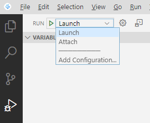
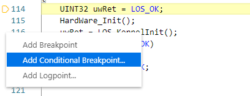
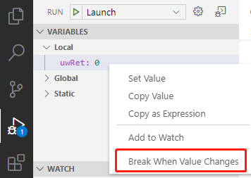
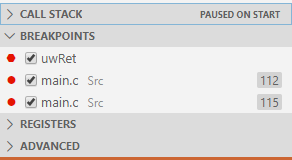
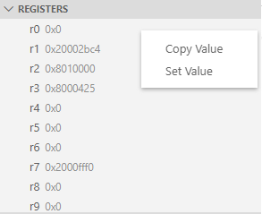

# Debugging
The IoT Link Studio default project has been configured with debugging parameters. Press F5 on the keyboard to start debugging.
> Before debugging, please ensure that the project has been correctly [built](project.md#Build) and [downloaded](project.md#Download) to the development board

## Debug Mode
IoT Link Studio supports two debugging modes: Launch and Attach:
* **Launch mode** will automatically restart the development board and stop at the main function
* **Attach mode** will not restart the development board and stop at the current running line of code

The user can make selections in the Debug Panel, or use ‘Add Configuration’ to perform other custom configurations.  

## Debug Configuration
Open ‘IoT Link Settings’-‘Project Settings’-‘Debugger’
For specific configuration, please refer to [Download](./project.md#Download).

## Advanced Debugging
### Conditional Breakpoint
1. Right-click on the line number of the code and click ‘Add Conditional Breakpoint’.  

2. In the pop-up interface, select ‘Expression’ and enter the interrupt condition you need.  

### Watchpoint
1. In the Debug Panel - Variables area, right-click to specify the variable to be monitored, select ‘Break When Value Changes’ to add a watchpoint, and the program will automatically pause when the variable's value is modified.  

2. You can view and manage the added watchpoints in the Debug Panel - Breakpoints area.  

### Registers
1. In the Debug Panel - Registers area, you can view the current registers value.
2. Right-click to copy or set the selected register's value.  

### Disassembly
1. In the Debug Panel - Advanced area, click ‘Switch to assembly’.  

1. The code area will be automatically switched to disassembly, and Step over \ Step into \ Step out will execute only one assembly statement. You can switch back to the original mode by ‘Switch to code’ on the left panel.  

3. In the Debug Panel - Advanced area, click ‘Disassemble function’ and enter the function name to view the disassembly code of the corresponding function.

### Memory
1. In the Debug Panel - Advanced area, click ‘View Memory’.  

2. Enter the corresponding memory start address and length, you can view the memory information of the device in real time.  
