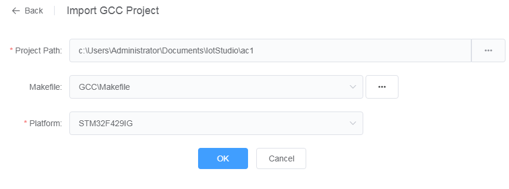
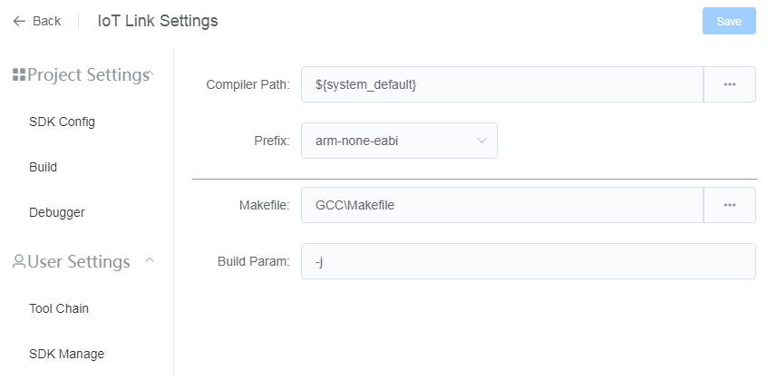
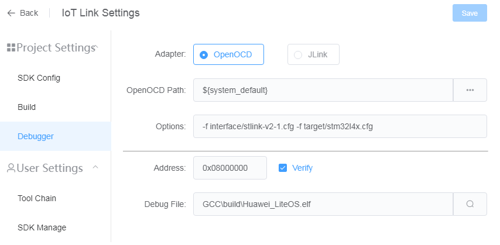
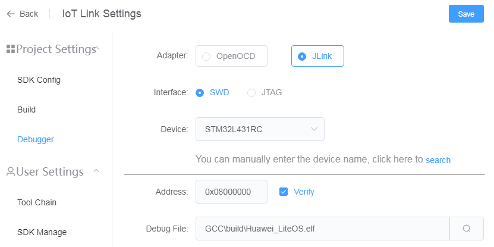

# Project Management

## Create Project
1. Click the "Home" button in the toolbar at the bottom of VSCode  

2. Click ‘Create IoT Project’ in the pop-up interface

3. Enter the project name, project path, and select the hardware platform of the development board
4. Select the project template in the list
5. Click ‘OK’ to complete the creation.

## Import Project
1. Click the "Home" button in the toolbar at the bottom of VSCode  

2. Click ‘Import GCC Project’ in the pop-up interface  

3. Select the project directory
4. The system will automatically search the makefile in the directory, you can select the correct makefile by pulling down
5. Select the hardware platform of the development board, the system will generate a default configuration according to the hardware platform
6. Click ‘OK’ to complete the import.

## Build
1. Click the "Build" button in the toolbar at the bottom of VSCode  

2. Wait for the system to be compiled
### Build Configuration
Open 'IoT Link Settings'-'Project Settings'-'Build'  

* You can choose a custom compiler path. The default ${system_default} will use the GCC tool directory configured in ‘IoT Link Settings’-‘User Settings’-‘Tool Chain’.
* Makefile and Make parameters used for compilation also can be configured here

## Download
1. Connect the development board to the computer with a data cable (if necessary, install the hardware driver of the corresponding development board)  
   > ST-LINK driver can be downloaded here: https://www.st.com/en/development-tools/stsw-link009.html
2. Click the "Download" button in the toolbar at the bottom of VSCode  

3. Wait for the system to download

### Download Configuration
Open ‘IoT Link Settings’-‘Project Settings’-‘Debugger’
* OpenOCD adapter
  
  * The OpenOCD path generally uses the default, only special development boards (such as RISC-V) need to be modified  
  * OpenOCD options need to be configured according to the development board, generally specify the interface type and hardware targets (the default has been configured according to the hardware platform at the time of project creation, no need to modify)

* JLink adapter
  
  * JLink driver needs to [download and install](https://www.segger.com/downloads/jlink/JLink_Windows.exe)  
  * After installation, specify the JLink directory in ‘IoT Link Settings’-‘User Settings’-‘Tool Chain’  
  * JLink debugger needs to specify the interface type and the device name, a list of supported device names can be queried here: https://www.segger.com/downloads/supported-devices.php

* Debug File
  * By default, the debug file will automatically search for the elf file in the compilation directory after compilation.  
  * You can also click the search button behind the input box to manually trigger the search.
  * If the identified file is not the desired debugging file, you can also modify it manually.