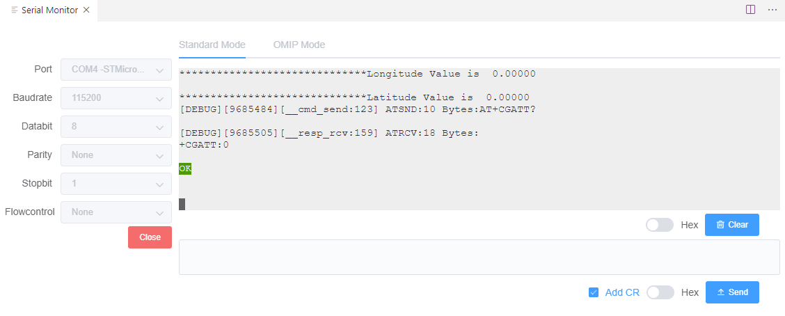
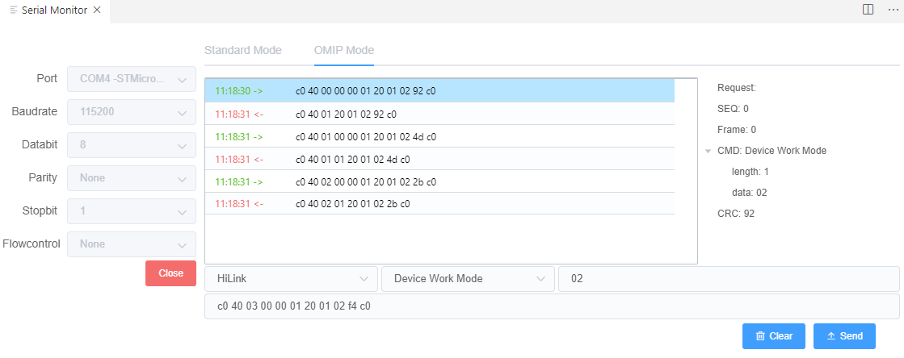

# Serial Port Tool

## Standard Mode
1. Click the "Serial" button in the toolbar at the bottom of VSCode  
   
2. Select the corresponding port number, baud rate and other parameters in the pop-up interface, then click ‘Open’  
   
3. Click the ‘Hex’ button below the output area to set the output content to text format or hexadecimal format
4. Click the ‘Hex’ button below the input area to set the input content to text format or hexadecimal format
5. When "Add CR" is checked, "\r" will be automatically added to the entered text  
> ** Note **: Closing the window does not close the underlying serial port, please manually click the ‘Close’ button

## OMIP Mode
1. Switch to OMIP mode
2. Select the corresponding port number, baud rate and other parameters, then click "Open"  
   
3. In the input area, you can choose the command classification and command type, and you can also fill in the data of the command
4. Click "Send" after modification
5. In the output area, you can view the sent commands and the return of the device. Select a line to to view the details of the command